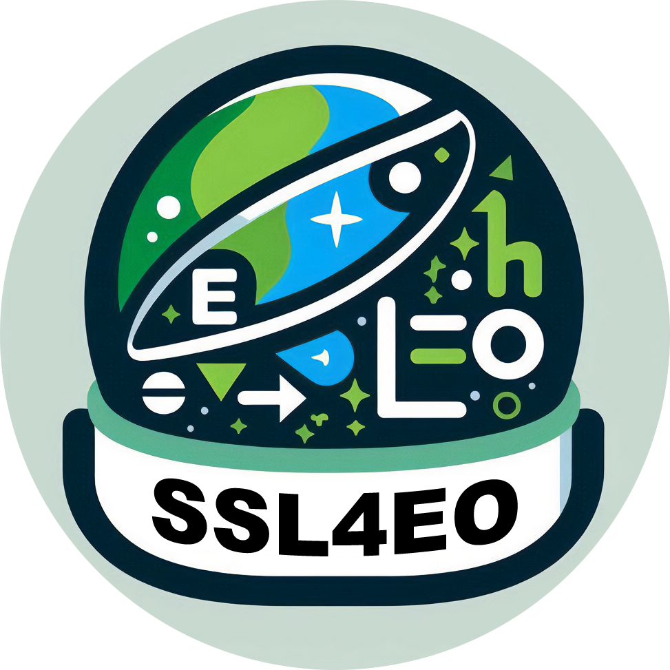

# SSL4EO  
Code base for the course: Self-Supervised Learning for Earth Observation

## Setup

Conda or Mamba (preferred) is required for the setup.
We assume that you have a NVIDIA GPU available.

1. create the python env: `mamba env create -f env.yml`
2. activate the env: `mamba activate ssl4eo`
2. download the MMEarth data (~45 GB): `curl -L https://sid.erda.dk/share_redirect/fnCZOGsWDC -o data_100k_v001.zip`
3. Make a directory for data: `mkdir <your path>`
4. unzip the folder: `unzip data_100k_v001.zip -d <your path>`
5. set the env variable to your MMEarth directory: `export MMEARTH_DIR=<your path> `
6. Install geobech: `pip install geobench`
7. to download geobench data, run: `geobench-download`
8. (optional) run the tests: `pytest`

## Deic setup

Follow the _[SSL4EO Mini-Projects instructions - Compute access on DEIC](https://docs.google.com/document/d/1E4yG7y6fgcgvodaDsTtrts-Aiw2nb32s8Tb3S-w4C38/edit?usp=sharing)_ to get started with DeiC. Once you have access to DeiC - course resources and started a container and run the following. It will install and prepare your conda env in ~10 mins: 

1. Run `bash deic_init.sh`

## Start training

example for training with VICReg:
`python main.py --methods vicreg`
